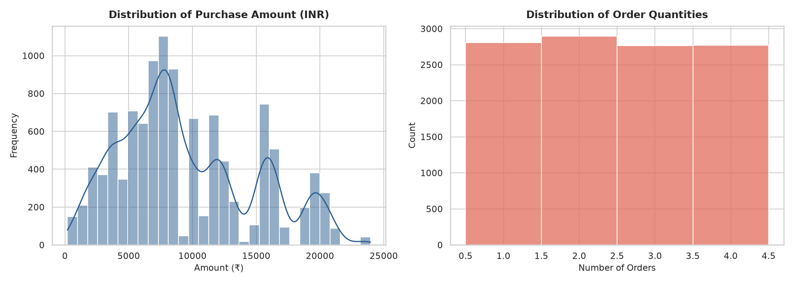
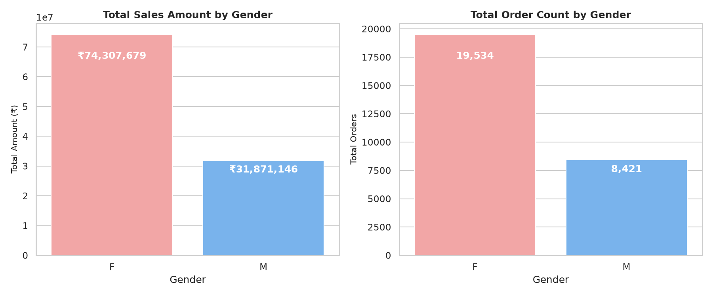
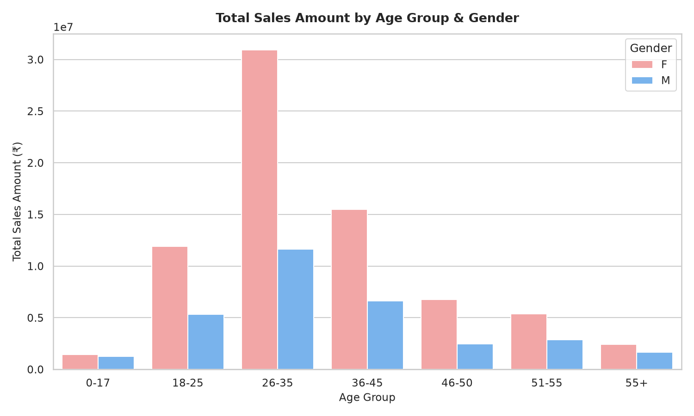
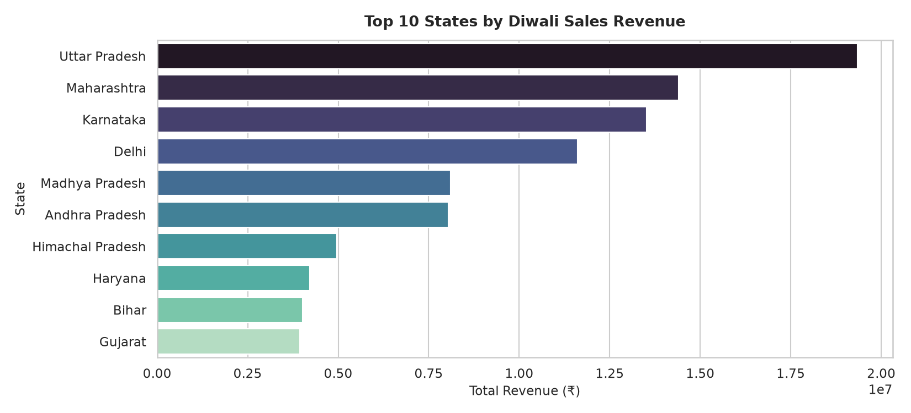
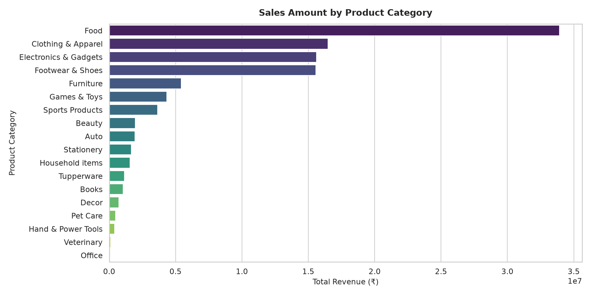
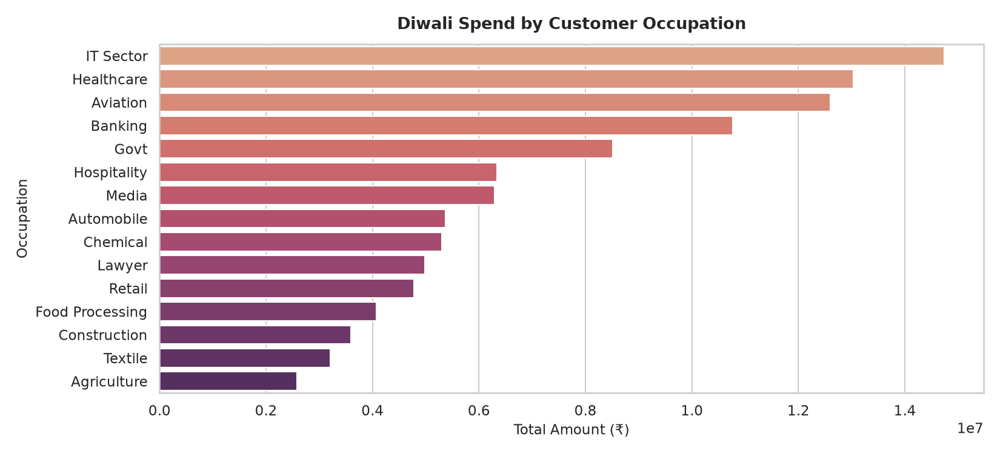
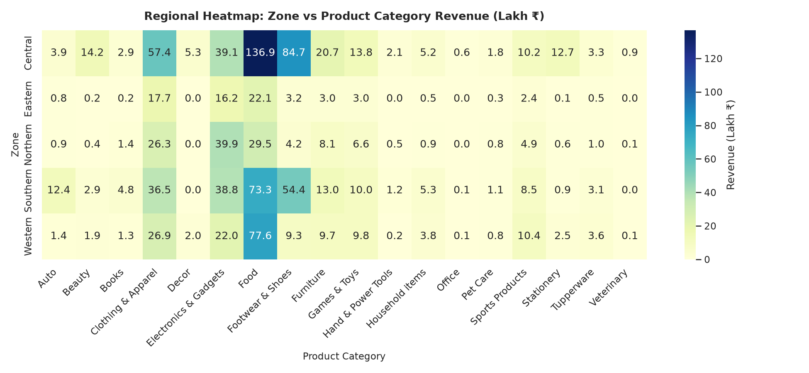
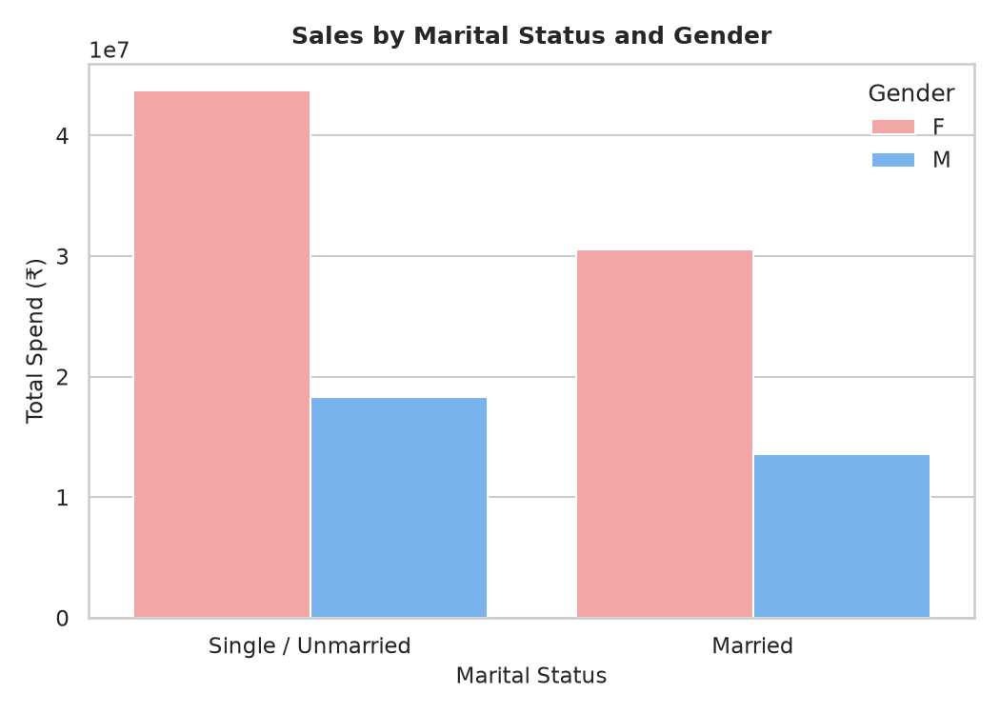
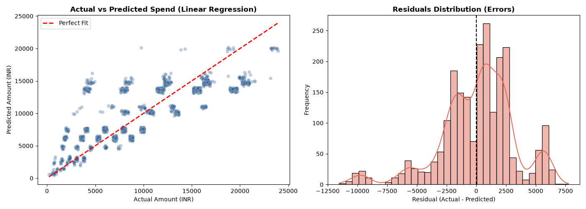
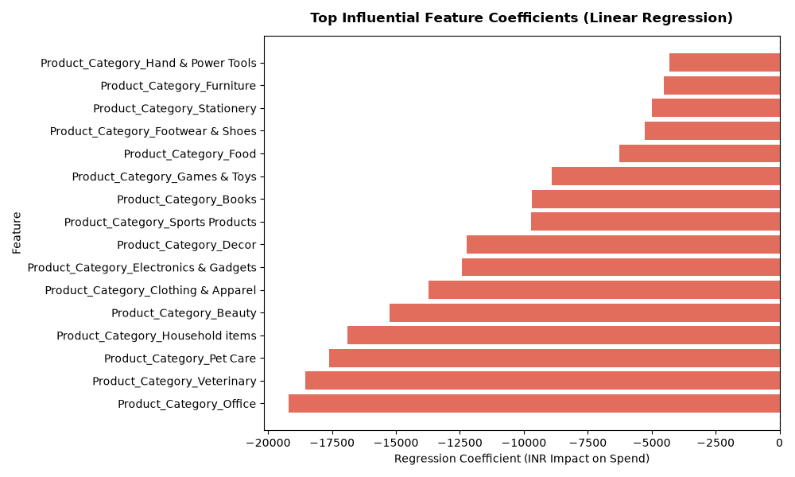

# 🪔 Diwali Sales Analysis & Predictive Modeling

[](https://www.python.org/)
[](https://scikit-learn.org/)
[](https://pandas.pydata.org/)
[](https://seaborn.pydata.org/)
[](LICENSE)
[](#)

An end-to-end data analytics and machine learning project exploring consumer purchasing behavior during the festive **Diwali season in India**. This repository contains complete data cleaning pipelines, detailed exploratory data analysis (EDA), interactive customer segmentation, and a regression-based machine learning pipeline predicting customer spend (`Amount` in INR).

---

## 📌 Table of Contents

- [Executive Summary](#-executive-summary)
- [Key Business Insights](#-key-business-insights)
- [Dataset Architecture](#-dataset-architecture)
- [Exploratory Data Analysis (EDA)](#-exploratory-data-analysis-eda)
- [Machine Learning Pipeline](#-machine-learning-pipeline)
  - [Model Benchmarking & Performance](#model-benchmarking--performance)
  - [Residuals & Error Analysis](#residuals--error-analysis)
  - [Feature Influence](#feature-influence)
- [Repository Structure](#-repository-structure)
- [Installation & Setup](#-installation--setup)
- [How to Run](#-how-to-run)
  - [1. Run Data Analysis & Generate Visualizations](#1-run-data-analysis--generate-visualizations)
  - [2. Train Machine Learning Models](#2-train-machine-learning-models)
  - [3. Predict Customer Purchase Amount (Inference)](#3-predict-customer-purchase-amount-inference)
  - [4. Run Interactive Jupyter Notebook](#4-run-interactive-jupyter-notebook)
- [Actionable Business Recommendations](#-actionable-business-recommendations)
- [Tech Stack](#-tech-stack)
- [License](#-license)

---

## 📊 Executive Summary

During the annual Diwali shopping peak, retail businesses face challenges in inventory allocation, targeted promotions, and personalized discounting. This project analyzes **11,250+ customer transactions** across various Indian states, age demographics, occupations, and product categories to answer two core questions:
1. **Who is buying what?** (Consumer profiling, geographic hot-spots, and high-revenue product categories).
2. **How much will a customer spend?** (Predictive modeling to estimate transaction spend based on customer profiles and basket characteristics).

```
============================================================
              DIWALI SALES PERFORMANCE METRICS
============================================================
• Total Revenue Generated : INR 106,178,825 (~10.6 Crore ₹)
• Total Orders Placed     : 27,955 items
• Unique Active Buyers    : 3,752 customers
• Average Order Value     : INR 3,798.21
• Dominant Customer Group : Married Females (26–35 age group)
• Top Contributing State  : Uttar Pradesh (INR 1.93 Crore)
• Top Revenue Category    : Food (followed by Clothing & Electronics)
• Top Occupation Segment  : IT Sector, Healthcare, Aviation
============================================================
```

---

## 💡 Key Business Insights

1. **Female Buyers Drive Festive Sales**:
   - **70.0%** of total revenue (`INR 74.3M`) is generated by female shoppers, outspending male shoppers by more than 2.3x.
2. **Age Bracket 26–35 is the Prime Segment**:
   - Customers aged 26–35 contribute over **45%** of overall orders and revenue. Young adults (18–25) and middle-aged adults (36–45) form the secondary growth segment.
3. **Marital Status Dynamics**:
   - Married customers account for significantly higher festive expenditures than unmarried individuals across all age brackets.
4. **Geographic Concentration in Central and Southern India**:
   - The top 3 spending states are **Uttar Pradesh, Maharashtra, and Karnataka**, together accounting for over 50% of festive shopping revenue.
5. **High-Value Product Categories**:
   - **Food** generated the largest total sales volume, followed by **Clothing & Apparel** and **Electronics & Gadgets**. High ticket sizes are observed in Footwear & Electronics.
6. **High-Income Professional Groups**:
   - Salaried professionals in the **IT Sector, Healthcare, and Aviation** represent the most lucrative customer segments with the highest disposable basket size.

---

## 🗂️ Dataset Architecture

The project processes `Diwali Sales Data.csv`, which contains customer-level transaction records:

### Schema Overview

| Feature | Type | Description |
|---|---|---|
| `User_ID` | Integer | Unique identifier for each customer |
| `Cust_name` | String | Customer's full name |
| `Product_ID` | String | Unique product stock keeping unit (SKU) |
| `Gender` | Categorical | Customer gender (`F`, `M`) |
| `Age Group` | Categorical | Binned age range (`0-17`, `18-25`, `26-35`, `36-45`, `46-50`, `51-55`, `55+`) |
| `Age` | Integer | Actual age in years (12 to 92) |
| `Marital_Status` | Binary | Marital flag (`0`: Single / Unmarried, `1`: Married) |
| `State` | Categorical | State of residence (16 Indian states represented) |
| `Zone` | Categorical | Geographic zone (`Central`, `Southern`, `Western`, `Northern`, `Eastern`) |
| `Occupation` | Categorical | Buyer's employment industry (15 industries) |
| `Product_Category`| Categorical | Category of purchased product (18 categories) |
| `Orders` | Integer | Quantity of items purchased in transaction (1 to 4) |
| `Amount` | Float / Int | Transaction value in INR (Target Variable) |
| `Status`, `unnamed1`| Null | Empty audit columns (dropped during cleaning) |

### Cleaning Operations
- Dropped 100% null columns (`Status` and `unnamed1`).
- Deduplicated identical transaction rows.
- Dropped records with missing transaction amounts (12 records).
- Type-casted `Amount` and `Orders` to native integers.
- Cleaned dataset is saved automatically as `Diwali_Sales_Cleaned.csv` (11,231 rows × 13 columns).

---

## 📈 Exploratory Data Analysis (EDA)

The data exploration pipeline creates high-resolution visual reports saved in the `assets/` directory:

### 1. Purchase Distribution & Quantities

*Right-skewed spend distribution with transaction values clustering between INR 2,000 and INR 18,000, with discrete order quantities ranging from 1 to 4.*

### 2. Gender Spending Breakdown

*Female shoppers represent the majority of both purchase volume (orders) and total transaction amount (70% share).*

### 3. Age Group & Gender Cross-Analysis

*The 26–35 age bracket is the largest revenue contributor for both genders, followed by 36–45 and 18–25.*

### 4. Top States by Festive Revenue

*Uttar Pradesh, Maharashtra, Karnataka, and Delhi dominate overall Diwali spending.*

### 5. Product Category Revenue & Basket Value

*Food, Clothing, and Electronics lead overall volume, while Footwear and Auto show high per-order transaction amounts.*

### 6. Occupational Spend Analysis

*IT Sector, Healthcare, Aviation, and Banking employees show the highest total festival spending power.*

### 7. Regional Zone vs. Product Heatmap

*Central and Southern zones exhibit heavy sales concentration in Food and Apparel categories.*

### 8. Marital Status & Gender Comparison

*Married females represent the highest spending demographic segment of the festive season.*

---

## 🤖 Machine Learning Pipeline

The project implements a machine learning regression pipeline (`train.py`) to forecast the expected purchase amount (`Amount`) for any given customer transaction.

### Preprocessing & Featurization
- **Strict Featurization Ordering**: 80/20 train-test split applied **before** fitting transformations to prevent data leakage.
- **Categorical Encoding**: `OneHotEncoder(drop='first', handle_unknown='ignore')` applied to `Gender`, `Marital_Status`, `Zone`, `Occupation`, and `Product_Category`.
- **Numerical Scaling**: `StandardScaler` applied to `Age` and `Orders`.
- **Cross-Validation**: 5-Fold cross-validation conducted on the training set.

### Model Benchmarking & Performance

Four regression algorithms were benchmarked under identical splits and evaluation metrics:

| Model | MAE (INR) | RMSE (INR) | Holdout $R^2$ | 5-Fold CV $R^2$ Mean | 5-Fold CV $R^2$ Std |
|---|:---:|:---:|:---:|:---:|:---:|
| **Linear Regression (Best)** | **₹2,375.48** | **₹3,149.24** | **0.6380** | **0.6441** | **±0.0094** |
| Ridge Regression | ₹2,384.54 | ₹3,161.71 | 0.6351 | 0.6423 | ±0.0097 |
| Gradient Boosting Regressor | ₹2,455.75 | ₹3,343.88 | 0.5919 | 0.6064 | ±0.0121 |
| Random Forest Regressor | ₹2,499.04 | ₹3,462.08 | 0.5625 | 0.5766 | ±0.0135 |

> **Key Takeaway**: Linear Regression delivers the strongest generalization score ($R^2 \approx 0.64$, CV $R^2 = 0.6441$) with minimal variance across folds and low computational latency.

### Residuals & Error Analysis

*Actual vs. Predicted spend alignment shows symmetric, bell-shaped residual error distribution centered at 0.*

### Feature Influence

*Regression coefficients highlighting high positive spend drivers (e.g. Footwear, Food, high order quantities) and baseline categories.*

---

## 📁 Repository Structure

```
Diwali_Sales_Analysis/
├── assets/                               # High-resolution charts & figures
│   ├── 01_distribution_amount_orders.png
│   ├── 02_gender_analysis.png
│   ├── 03_age_group_analysis.png
│   ├── 04_top_states_sales.png
│   ├── 05_product_category_sales.png
│   ├── 06_occupation_sales.png
│   ├── 07_zone_category_heatmap.png
│   ├── 08_marital_status_sales.png
│   ├── 09_model_residuals.png
│   └── 10_model_feature_impact.png
├── Diwali Sales Data.csv                 # Raw dataset (11,251 rows)
├── Diwali_Sales_Cleaned.csv              # Processed & cleaned dataset (11,231 rows)
├── Diwali_Sales_Analysis_Project.ipynb   # Interactive analysis notebook
├── run_analysis.py                       # Automated data cleaning & EDA pipeline
├── train.py                              # ML model training, benchmarking & serialization
├── predict.py                            # CLI inference script & persona benchmarking
├── diwali_sales_model.joblib             # Serialized best ML pipeline
├── model_features.json                   # Feature metadata & categorical schema
├── model_metrics.json                    # Benchmark metrics & model evaluation logs
├── requirements.txt                      # Pinned Python package dependencies
├── .gitignore                            # Git exclusion rules
├── LICENSE                               # MIT License
└── README.md                             # Comprehensive project documentation
```

---

## ⚙️ Installation & Setup

### Prerequisites
- Python 3.9, 3.10, or 3.11 installed on your system
- Git installed

### 1. Clone the Repository
```bash
git clone https://github.com/Sameer200425/Diwali_Sales_Analysis.git
cd Diwali_Sales_Analysis
```

### 2. Create and Activate Virtual Environment
**Windows (PowerShell):**
```powershell
python -m venv .venv
.venv\Scripts\Activate.ps1
```

**Windows (Command Prompt):**
```cmd
python -m venv .venv
.venv\Scripts\activate.bat
```

**macOS / Linux:**
```bash
python3 -m venv .venv
source .venv/bin/activate
```

### 3. Install Dependencies
```bash
pip install -r requirements.txt
```

---

## 🚀 How to Run

### 1. Run Data Analysis & Generate Visualizations
Executes data cleaning, prints executive statistics, exports `Diwali_Sales_Cleaned.csv`, and creates all 8 EDA figures in `assets/`:
```bash
python run_analysis.py
```

### 2. Train Machine Learning Models
Runs train/test splitting, trains 4 regression algorithms, logs cross-validation metrics to `model_metrics.json`, creates evaluation plots, and saves `diwali_sales_model.joblib`:
```bash
python train.py
```

### 3. Predict Customer Purchase Amount (Inference)

#### Option A: Benchmark Predefined Customer Personas
```bash
python predict.py --demo
```

*Sample Output:*
```
* [Persona] Tech Professional (High-Spender Segment)
  - Profile    : 29yo F | Married | IT Sector in Central Zone
  - Cart       : Category = Food | Orders = 3
  - Prediction : INR 13,732.10

* [Persona] Young Healthcare Worker
  - Profile    : 26yo F | Single | Healthcare in Southern Zone
  - Cart       : Category = Clothing & Apparel | Orders = 2
  - Prediction : INR 6,234.15
```

#### Option B: Predict on Custom Customer Data
Provide custom command-line parameters:
```bash
python predict.py --age 32 --gender F --marital-status 1 --zone Central --occupation "IT Sector" --category Food --orders 3
```

*Sample Output:*
```
============================================================
      DIWALI SALES PREDICTION - CUSTOM INFERENCE
============================================================
Customer Input:
  * Age               : 32
  * Gender            : F
  * Marital_Status    : 1
  * Zone              : Central
  * Occupation        : IT Sector
  * Product_Category  : Food
  * Orders            : 3
------------------------------------------------------------
Predicted Purchase Amount: INR 13,723.67
============================================================
```

### 4. Run Interactive Jupyter Notebook
To run and inspect the notebook interactively:
```bash
jupyter notebook Diwali_Sales_Analysis_Project.ipynb
```

---

## 🎯 Actionable Business Recommendations

Based on empirical data analysis and predictive modeling, retail teams should adopt the following strategies for the upcoming Diwali season:

1. **Targeted Female-Centric Campaigns**:
   - Focus digital marketing and social media advertisements on **married females aged 26–35**.
   - Create curated festive gift boxes combining **Food & Sweets** with **Apparel & Decor**.
2. **Regional Inventory Optimization**:
   - Prioritize distribution hubs and inventory stocking in **Uttar Pradesh, Maharashtra, Karnataka, and Delhi**.
   - Ensure express delivery and local warehouse availability in top tier-1 and tier-2 metros across Central and Southern zones.
3. **Corporate and Industry Partnerships**:
   - Offer customized corporate gifting deals and credit card cashbacks tailored for employees in the **IT, Healthcare, and Aviation** sectors.
4. **Bundle Discounts & Upselling**:
   - Incentivize higher basket size through tier-based discounts (e.g. *“Spend ₹10,000, Get ₹1,500 Festive Bonus”*), converting single-item shoppers into multi-order buyers.

---

## 🛠️ Tech Stack

- **Language:** Python 3.11
- **Data Manipulation:** `pandas`, `numpy`
- **Machine Learning:** `scikit-learn` (`Pipeline`, `ColumnTransformer`, `LinearRegression`, `RandomForestRegressor`, `GradientBoostingRegressor`)
- **Data Visualization:** `matplotlib`, `seaborn`
- **Model Serialization:** `joblib`
- **Notebook Environment:** `Jupyter Notebook` / `IPython`

---

## 📜 License

This project is licensed under the [MIT License](LICENSE) - feel free to use and adapt it for learning and commercial projects.
